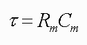
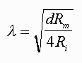

# Derivetive In Medical

For assignment application of derivative in medicine

Speed of axon conduction

#Intro
Nowaday, world have been developing by numerous of people and technology

let me talk about axon and how to calculate speed of conduction

