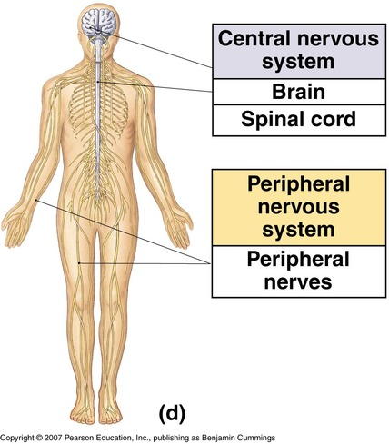
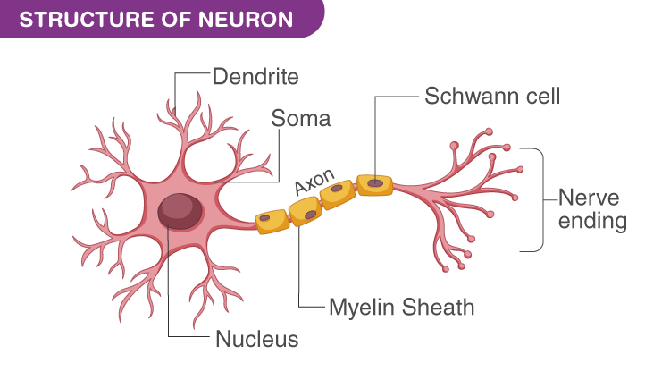
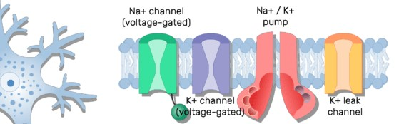
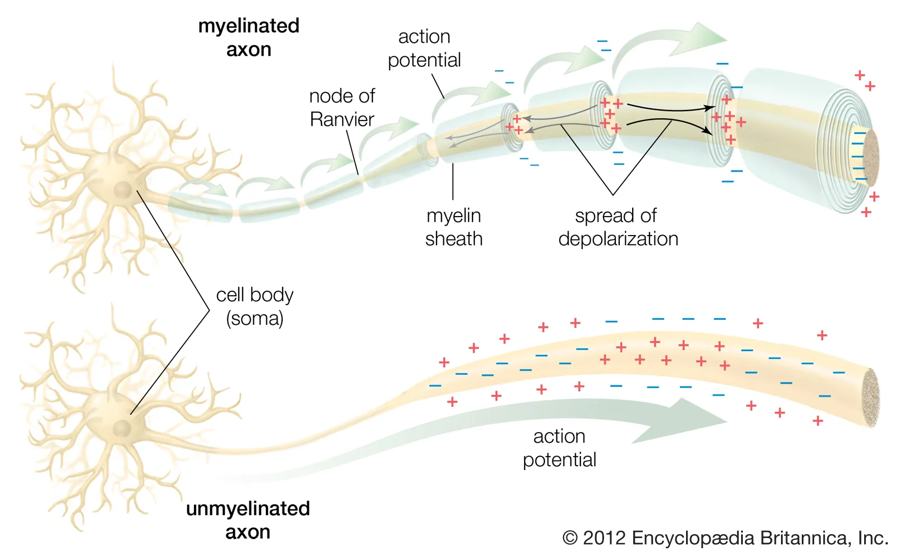
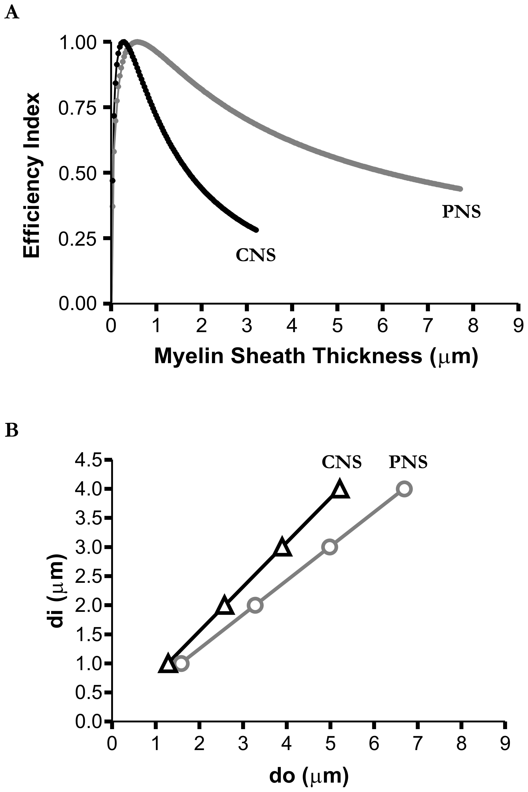
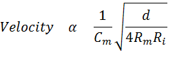
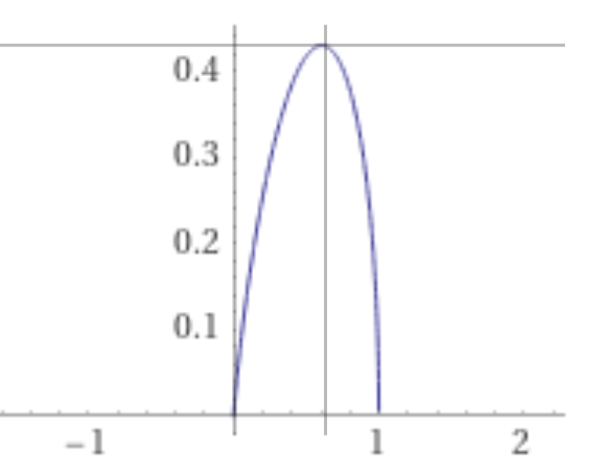

<!-- # Derivetive In Medicine

For assignment application of derivative in medicine -->

# Axon conduction velocity and structure by Rushton's Differential Equation

## Introduction

> It was reasonable for people to think that mathematics was unnecessary for learning because they were unknowing to apply it. Moreover, Mathematics has been used in every part of life which was modified and adapted to be easier to utilize and more understandable. This Document will use calculus to explain medical knowledge in axon conduction velocity topic.

## Basic knowledge about Axon

#### Axon structure and action potential

> Neuron system separates by location into two areas the central nervous system (CNS) and the peripheral nervous system (PNS). The CNS contains the brain and spinal cord locate in the center of the body. Also, PNS combines with peripheral long distant nerves to transfer signals from extremities and organs to CNS.

> Each neuron cell contains three main parts dendrite, soma, and axon. Typically, It has a cell membrane that contains phospholipid bilayers and separates Na ion more in an extracellular but K ion more in the intracellular. In addition, the axon membranes contain Na and K channels which can control the voltage between intracellular and extracellular.

<!-- In additionally, they have three main type of channels. Firstly, Unconjugated or leakage channel which contains Na and K channel allow both K with Na pass through cell membrane by electric flow. Secondly, conjugated channel such as ligated, mechanic, and electric that have Na and K channel too. -->

> When the stimuli come, Na channels open while Na ions pass through the cell membrane causing ions in the intracellular to become more positive. Then activating other Na channels to open and reach the threshold leads to an action potential. Furthermore, it induces other areas into an active state and transmits to the target. Moreover, myelin sheath makes the conduct process faster because of saltatory conduction. Conduction can jump across myelinated areas making velocity shorter ten times.

      

#### Axon conduction velocity in CNS and PNS

> G-ratio is a significant value in axon they can determine the function and structure of myelinated optimization which g value is the ratio of the inner and total outer diameter of axon include myelin sheath thickness.

> In fact, Axon in PNS and CNS have optimized in difference g-ratio due to their function. Almost PNS trend to adapt for rapid transmit sensory from organ to CNS as well as bring command from brain to control extremities such as hold object, walk, and maintain posture. This PNS has an average g-ratio of about 0.6 and optimizes for maximizing axon conduction velocity due to long-distance transportation.

> However, In CNS optimal g-ratio was approximately 0.77 since the conduction velocity maximization is not the main criteria for structure optimization due to short distance and volume constriction. Also, they need a suitable adaptation for other functions such as minimizing conduction delays, resisting high-pressure overload from the skull and spine, and saving consumption energy.

> These two graphs illustrate the relationship between myelin sheath thickness and efficacy index(A), inner and outer diameter of the axon(B) in both CNS and PNS.

<!--

 -->

<!-- $e^{i\pi} + 1 = A$

$\sum_(i=1)^n i^3=((n(n+1))/2)^2$

$\sum_{n=1}^{10} n^2$

$\frac{dx}{dt}$

$\log{_a}{n}$ -->

## Rushton's equation

> From Rushton's experimentation, they acquire parameters that predict axon conduction velocity by structural diameter. In addition, they discover an optimal g-ratio of 0.6 for the best conduction velocity

$$Conduction \space Velocity \space\space \alpha \space\space \frac{d}{D}\sqrt{\log{_e}\frac{D}{d}}$$

$d\space\space\space\space=$ Inner axon diameter
$D\space\space\space=$ Total outer axon diameter (inner diameter combine with myelin sheath thickness)

The definition of g-ratio ; $g=\frac{d}{D}$

$$CV \space\space \alpha \space\space g\sqrt{(-\ln{g})}$$
Formular:
$$CV = kg\sqrt{(-\ln{g})}$$

$CV\space=$ Conduction velocity of axon
$k\space\space\space\space=$ Conduct constant
$g\space\space\space\space=\displaystyle\frac{d}{D}$ ; The ratio between inner and outer axon diameter
$d\space\space\space\space=$ Inner axon diameter
$D\space\space\space=$ Total outer axon diameter (inner diameter combine with myelin sheath thickness)

> To get maximum velocity we differentiate this equation to get a crescent point where the slope was zero

$$k\frac{\partial }{\partial g} (g\sqrt{(-\ln{g})}) = 0$$

$$g( \frac{\partial \sqrt{(-\ln{g})}}{\partial g}) + \frac{\partial g}{\partial g} (\sqrt{(-\ln{g})})= 0$$

$$g[ \frac{1}{2\sqrt{(-\ln{g})}}\frac{\partial {(-\ln{g})}}{\partial g}] +  \sqrt{(-\ln{g})}= 0$$

$$g[ \frac{1}{2\sqrt{(-\ln{g})}}(-\frac{1}{g})] +  (\sqrt{(-\ln{g})})= 0$$

<!-- $$\sqrt{(-\ln{g})} [1+\frac{1}{2\ln{g}}]=0$$ -->

<!-- $$\sqrt{(-\ln{g})}=0$$
$$\ln{g}=0$$
$$g=e^0=1$$

g cannot become 1 because this is myelinated axon -->

<!-- $$ 1+\frac{1}{2\ln{g}}=0$$ -->

$$ \sqrt{(-\ln{g})}= \frac{1}{2\sqrt{(-\ln{g})}} $$

$$ (\sqrt{(-\ln{g})})^2= \frac{1}{2} $$

$$-\ln{g}=\frac{1}{2}$$

$$\log{_e}{g}=-\frac{1}{2}$$

$$g=e^{-1/2}=\frac{1}{\sqrt{e}}=\frac{1}{2.71828...}$$

$$g=0.60653...$$

> G value 0.6 can create the highest value for this function

> Example graph demonstrates if K=1

### Conclusion

> Taking everything into consideration, the g ratio was discovered by Rushton's experiment that uses the formula to predict axon conduction velocity to determine an optimization of the axon. G value 0.6 provide maximum speed for axon came from differentiation equation to find a crescent point. PNS requires a high speed to transmit signals from far areas but CNS has a g-ratio of 0.77 for global optimization in every part not only maximizing speed.

<!-- - 
- 
-  -->

### Referrence

> Ref:Rushton W.A.H. A theory of the effects of fibre size in medullated nerve. J. Physiol. 1951;115:101–122.

> image ref:
> https://cdn1.byjus.com/wp-content/uploads/2020/02/STRUCTURE-OF-NEURON.png > https://www.getbodysmart.com/wp-content/uploads/2017/09/Proteins-Axon-Structure-and-Functions-Labeled-770x500.png > https://biology12plo.weebly.com/peripheral-nervous-system-pns.html
